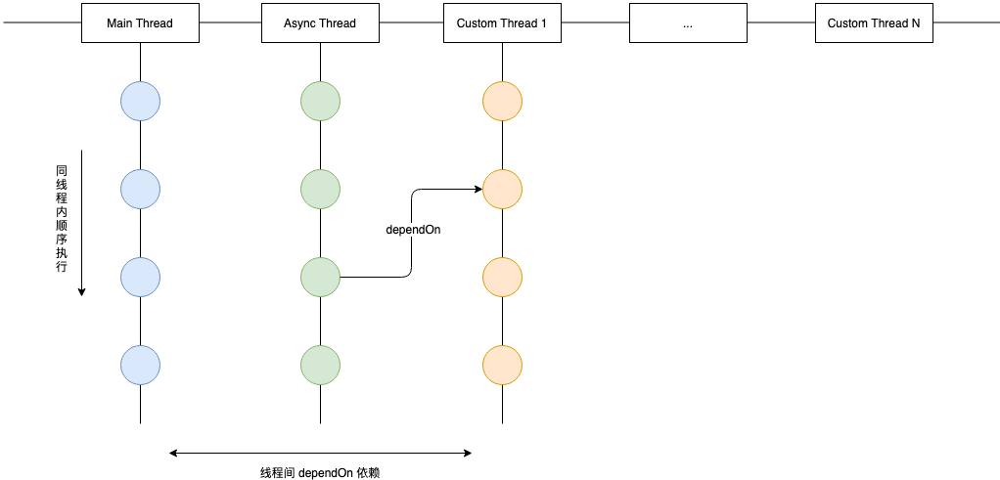

# tiny-boot
app 启动管理器，用于编排 app 启动任务，任务之间的依赖关系等。

## 设计思路

任务之间最多有两种关系

* 同线程的先后执行顺序：按添加到队列的顺序来
* 不同线程之间的依赖顺序：通过 dependOn 添加依赖



BootManager 启动线程数量

* main：内置
* async：内置
* customs：可以自己任意开启

## 使用方法
### BootManager
* 注册任务
    * registerOnMainThread：注册 UI 线程的任务
    * registerOnAsyncThread：注册异步线程的任务
* 开始执行
    * executeMain：执行 UI 线程的任务
    * executeAsync：执行异步线程的任务
    * executeCustom：执行自定义线程的任务队列

```
public class BootManager {
    public void registerOnMainThread(AbstractTask task) { }

    public void registerOnAsyncThread(AbstractTask task) { }

    public void executeMain() { }

    public void executeAsync() { }

    public void executeCustom(TaskQueue queue) { }
}
```

### Task & AbstractTask
用户的 task 继承 AbstractTask 的方法即可，主要实现

* getName：获取任务名称
* execute：执行任务，需要调用 super.execute

```
public interface Task {
    /**
     * @return 任务名，用于统计和日志记录
     */
    @NonNull
    String getName();

    /**
     * 执行启动任务
     */
    void execute();

    /**
     * 用于配置不同启动线程之间的任务依赖关系，不能避免出现循环依赖
     * @param task 其他启动线程的任务
     */
    void dependOn(@NonNull Task task);
}
```

### 示例
见 app 代码。